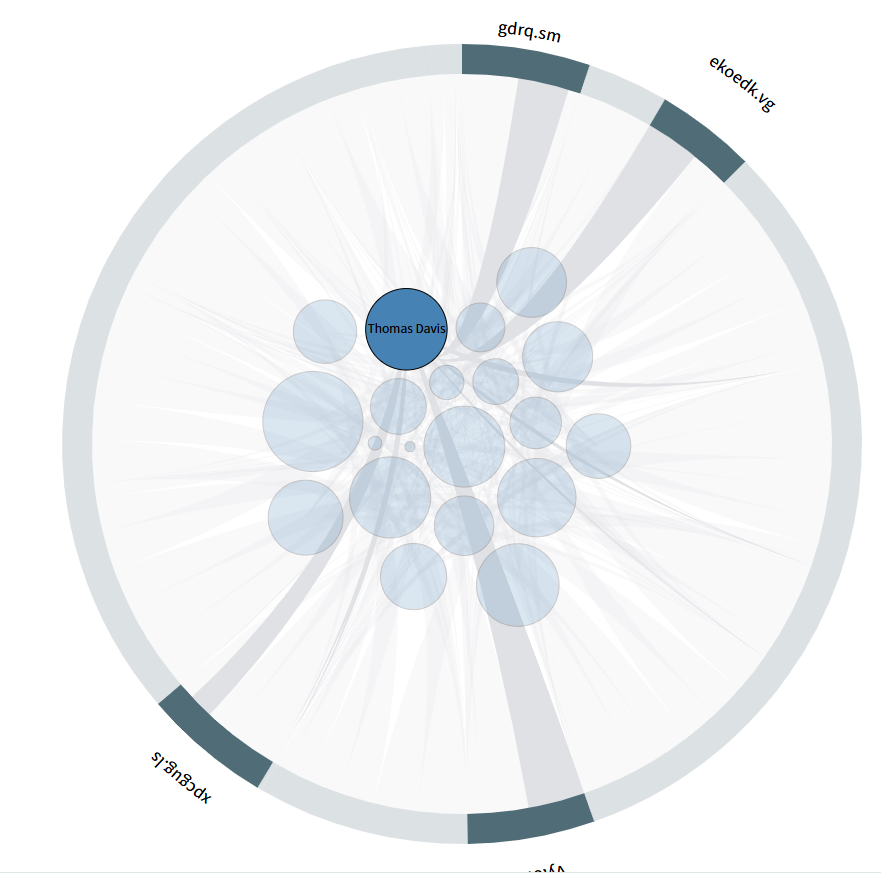
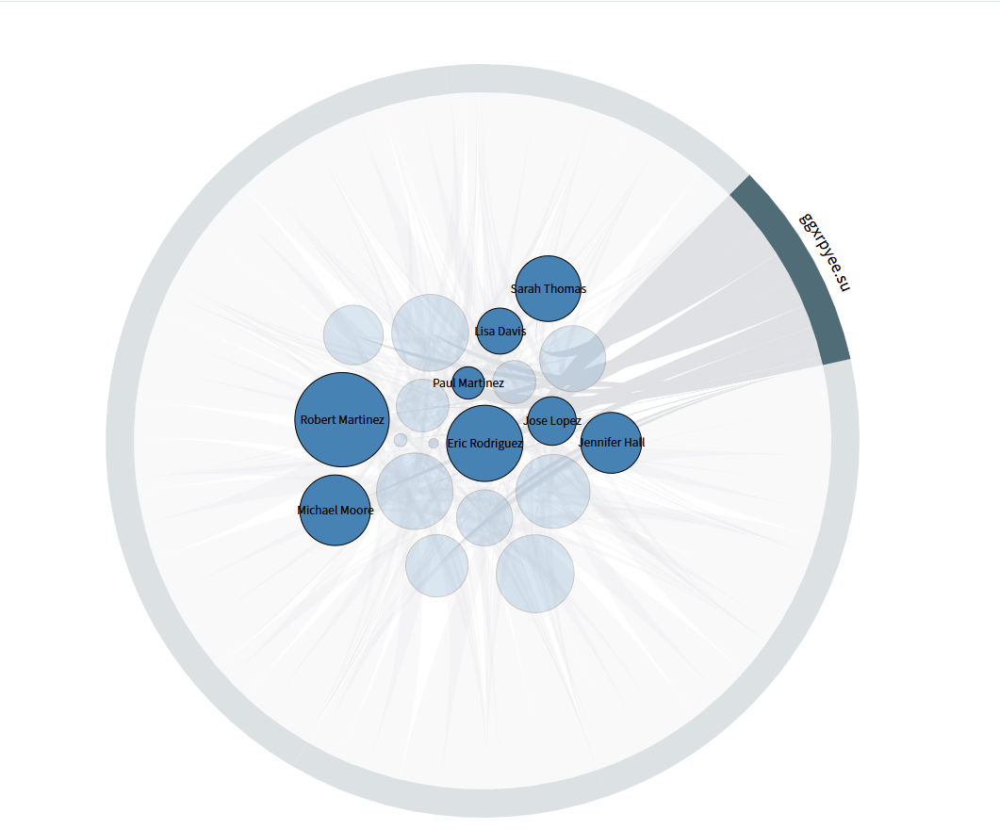

# Chord-Pack 图可视化

本项目实现了一种结合 Chord Diagram（弦图）与 Circle Packing（圆打包）的可视化组件，称为 **chord-pack 图**。
该组件能够直观展示弧（chord）与圆（pack）之间的多对多关系，适用于网络流量、社交关系、分组统计等多种场景。

## 主要特点

- **弦图（Chord）**：外圈弧形展示主分类或主节点，弧的长度和粗细可根据数据动态调整。
- **圆打包（Pack）**：内圈圆形展示子分类或子节点，圆的大小与数据量成正比。
- **关系连线**：通过平滑的曲线将弧与圆连接，清晰表达它们之间的对应关系。
- **交互高亮**：支持鼠标悬停、点击高亮，便于探索数据细节。

## 效果预览

> *如上图所示，外圈为弦图，内圈为圆打包，曲线连接两者，整体结构清晰美观。*
